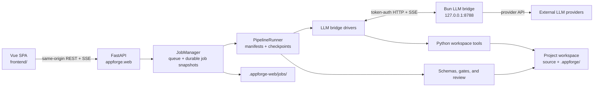

# AppForge-LLM v7 architecture

AppForge-LLM v7 (`openappforge` 0.7.0) is a local-first software-production
workbench. Its control plane, project files, validation evidence, and job history
remain on the user's machine. Model inference is delegated through a local bridge
to a configured external LLM provider.

The system is designed around one rule: model output is a proposal, while Python
code owns workspace access, policy enforcement, validation, and completion state.
The web interface is the primary user experience; the CLI reuses the same project,
pipeline, driver, tool, and checkpoint layers.

## Runtime topology



The browser never calls an LLM provider directly. FastAPI manages or connects to
the bridge, and the Python driver executes every tool request inside the selected
project workspace.

## Component responsibilities

### Vue web application

`frontend/` is a Vite and Vue single-page application served from packaged
assets by FastAPI. It provides:

- prompt submission and autonomous or guided execution mode;
- provider, model, generation, and pricing settings;
- job history, revision requests, cancellation, approval, and stage retry;
- live stage, LLM text, tool-call, and usage updates;
- artifact and source browsing, static preview, and source ZIP download.

The UI receives live updates through Server-Sent Events and refreshes the current
job snapshot when an event gap or connection failure occurs. Local storage holds
only the selected locale and current job ID; it is not the source of truth for job
or pipeline state.

### FastAPI web boundary

`appforge.web` serves the SPA and exposes narrow same-origin APIs for jobs,
artifacts, workspace reads, preview files, downloads, and LLM configuration.
It also owns the browser session and the managed bridge process lifecycle.

At launch, a one-use bootstrap value is placed in the URL fragment. The SPA
exchanges it for an `HttpOnly; SameSite=Strict` session cookie and removes the
fragment. Protected API routes require that session capability. Host, origin,
referer, and cross-site request checks restrict the application to the local
same-origin boundary.

### Job manager

`appforge.web_jobs.JobManager` is the web orchestration layer.

- It permits one running job at a time and maintains a FIFO queue, limited to
  eight queued/running jobs by default.
- Job states are `queued`, `initializing`, `running`, `packaging`,
  `awaiting_approval`, `completed`, `failed`, or `cancelled`.
- Each job snapshot is written atomically to
  `.appforge-web/jobs/<job-id>.json`.
- Runner events are mapped into bounded, user-facing event history and SSE
  notifications.
- Follow-up revisions create a new job and workspace derived from the parent;
  the parent workspace is not edited in place.

Queued jobs and approval waits survive a server restart. A job interrupted while
running is marked failed, while its project workspace and checkpoints are kept for
inspection or an explicit retry.

### Pipeline router and manifests

`appforge.pipelines` selects a built-in pipeline from the request, project type,
complexity, and whether an existing repository is being changed. A local
keyword/complexity router is always available; an optional LLM router may refine
the choice, with the local result retained as the fallback.

Versioned manifests under `appforge/resources/pipeline_defs/` are the policy
source of truth. Each stage declares:

- its name, purpose, and Markdown skill;
- required JSON artifacts;
- tools that may be exposed to the agent;
- executable required and optional gates;
- deterministic review focus and success criteria;
- whether human approval is required.

Small web requests use the compact `web-app-lite` path. Larger and specialized
requests use manifests for web, SaaS, API, CLI, data, desktop, mobile, automation,
prototype, library, feature, or bug-fix work.

### Stage packet and pipeline runner

`PipelineRunner` resolves the next incomplete stage from durable checkpoints.
For each attempt, the stage packet compiler combines the user request, stage
skill, schemas, prior validated artifacts, workspace context, safety policy, and
the previous structured failure.

The runner then:

1. removes any stale `stage-result.json`;
2. invokes the selected bridge driver with a bounded timeout and usage budget;
3. validates the newly submitted stage result and required artifacts;
4. executes declared gates and deterministic review;
5. writes a checkpoint only for the observed result;
6. advances, waits for approval, retries, or stops with a structured failure.

The default driver is `llm-bridge-agent`. It runs a multi-turn tool-use session.
`llm-bridge` remains available for single-shot JSON-envelope stages, and
`auto` resolves to the agent driver. Codex, Claude, and generic shell CLI
drivers are not supported in v7.

### Local LLM bridge

`llm_bridge/` is a Bun service that uses the vendored
`@opencode-ai/llm` engine to normalize provider configuration, model catalogs,
generation, streaming, API-key authentication, and tool-use sessions.

For the default loopback URL, `LLMBridgeProcessManager` starts the bundled
service on demand with an allowlisted environment. FastAPI generates a
high-entropy bridge capability in memory and sends it on every protected bridge
request. The bridge binds only to loopback and requires Bun plus the locked
`llm_bridge` dependencies. An operator-managed remote bridge is allowed only
over HTTPS and must use a matching token.

Provider metadata and the active model are stored under
`~/.appforge/llm/providers.json` by default. On macOS, API keys use Keychain
references by default. The file backend uses a user-owned private directory and
atomic private file writes.

### Workspace tools and gates

The bridge may request a tool, but Python decides whether and how it runs.
`ToolRegistry` discovers typed tools for workspace reads/writes, search,
dependency installation, commands, tests, lint, type checking, builds, security,
artifacts, and release preparation.

Safety values come only from project configuration. Model-supplied policy flags
are removed before execution. The default posture is:

- remote network access disabled;
- deployment disabled;
- destructive operations disabled;
- dependency installation allowed only for the project workspace.

Commands use argv validation, a sanitized environment, path containment, and
platform sandboxing where supported. If safe isolation is unavailable, execution
that needs broader authority is rejected unless the operator explicitly enabled
that authority.

## Completion invariant

A stage is complete only when all required evidence agrees:

```text
driver succeeded
AND a fresh stage result validates
AND every required artifact validates against its schema
AND every required executable gate passes
AND deterministic review has no critical finding
AND any required approval is recorded
```

A model response cannot mark itself complete. Changes made after
`submit_stage_result` invalidate that submission, and the result must be
submitted again. Checkpoints, not chat history or browser state, determine the
next stage.

## End-to-end job lifecycle

1. The user configures a provider and submits one natural-language request.
2. FastAPI validates the request and settings; the router selects a pipeline.
3. JobManager persists the queued job and starts it when the execution slot is free.
4. Preflight confirms bridge, provider, model, and driver readiness.
5. Project setup creates or derives a workspace and initializes `.appforge/`.
6. PipelineRunner executes manifest stages with tools, evidence, gates, repair,
   and optional approval.
7. A successful pipeline is secret-scanned and packaged as a verified source ZIP.
8. The user may build a sandboxed static preview, inspect evidence, download the
   archive, or start a revision job.

Static preview is an explicit, on-demand operation. It runs the detected build
command and serves a discovered `dist/` or `build/` tree under a restrictive
preview Content Security Policy.

## State ownership and persistence

| Mutable fact | Authoritative owner | Durable location or consumer |
|---|---|---|
| Pipeline order and stage policy | Pipeline manifest loader | `appforge/resources/pipeline_defs/*.yaml` |
| Web queue, status, history, usage, and download metadata | `JobManager` | `.appforge-web/jobs/<job-id>.json` |
| Project identity, selected pipeline, mode, and safety | Project initializer | `<project>/.appforge/project.json` |
| Stage completion and evidence | Checkpoint engine | `<project>/.appforge/checkpoints/` |
| Derived current/completed stage view | Checkpoint engine | `<project>/.appforge/state.json` |
| Structured stage outputs | Artifact validators | `<project>/.appforge/artifacts/` |
| Prompts, logs, reports, and compact recovery context | Runner and tools | `<project>/.appforge/{prompts,logs,reports,memory}/` |
| Generated application source | Workspace tools | `<project>/` outside `.appforge/` |
| Provider configuration and active model | Bun bridge config store | `~/.appforge/llm/providers.json` by default |
| Provider secrets | Bun bridge secret backend | macOS Keychain or private file backend |
| Browser session capability | FastAPI application | process memory plus an HttpOnly browser cookie |
| Bridge capability | `LLMBridgeProcessManager` | process memory plus the allowlisted bridge child environment |
| Current job ID and locale preference | Browser UI | local storage; never production state |

The `.appforge/` directory is the project control plane. It contains metadata,
evidence, and recovery records, but is excluded from the downloadable source
archive.

## Failure and recovery

- Stage attempts are bounded by the manifest or runtime override, normally three.
- A failed attempt records the prompt, driver result, artifacts, gates, review,
  logs, and a normalized failure for the next repair attempt.
- Repeated failure signatures and repeated identical tool calls trigger loop
  guards instead of unbounded retries.
- Retryable bridge transport failures can start bounded continuation sessions;
  cancellation and stage deadlines propagate across bridge requests.
- Guided stages persist `awaiting_human` checkpoints until approval.
- Queued jobs resume after a server restart; interrupted running jobs fail
  explicitly and keep their workspace for retry.
- Completed jobs are rechecked for a valid archive when loaded.

## Security boundaries

- The web server and managed bridge are loopback services; protected APIs use
  separate session and bridge capabilities.
- Remote bridge URLs require HTTPS. Credentials are not placed in generated
  project environments, browser storage, URLs, or public job payloads.
- Tool paths are resolved beneath the project root; managed, VCS, cache, and
  symlinked paths are blocked from the workspace browser.
- Tool results and logs are bounded and redacted before persistence.
- Preview content is served with a sandboxed CSP and cannot make network
  connections.
- Source packaging excludes VCS state, dependencies, caches, `.appforge/`, and
  common credential files. A secret scan, manifest check, and ZIP integrity check
  must pass before download is enabled.

## Extension boundaries

- Add or change workflow policy in a versioned pipeline YAML manifest.
- Add stage reasoning guidance in a Markdown skill.
- Add structured evidence through an artifact JSON schema.
- Add deterministic capability as a typed `Tool` implementation.
- Add provider/model support in the bridge registry and protocol layer.
- Add a driver only through explicit Python driver registration and matching
  validation tests.
- Keep UI concerns in the Vue/FastAPI boundary; pipeline policy remains
  independent of the browser.

These boundaries keep model reasoning replaceable while the local control plane,
evidence model, and safety rules remain deterministic and reviewable.

## Windows generated-code boundary

On Windows, `appforge.tooling.sandbox` routes project commands through a trusted Python helper rather than invoking the target directly. The helper creates or derives a per-workspace AppContainer SID, grants that SID only the workspace, disposable home, and approved toolchain access, and supplies `PROC_THREAD_ATTRIBUTE_SECURITY_CAPABILITIES` to `CreateProcessW`. The capability list is empty unless the governing command policy explicitly allows remote networking.

The target starts suspended and is assigned to a Job Object before execution. The job owns kill-on-close cleanup, process-count, job-memory, CPU-rate, and UI restrictions. Standard handles are the only inherited handles. Windows batch launchers are argument-forwarded through a fixed PowerShell script inside the same AppContainer; explicit shell requests remain subject to destructive-command approval.

The LLM bridge selects Windows DPAPI as its default secret backend. Provider configuration and encrypted secret blobs have separate files, and the provider document contains only a backend reference. macOS Keychain and the existing Linux private-file behavior are unchanged.
